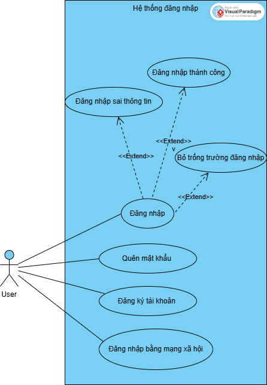

# 🧪 Selenium Test – Form Login

## 📌 Thông tin chung
Đây là bài tập kiểm thử **Form Login** bằng **Selenium + Python**.  
Mục tiêu: Viết script kiểm thử giao diện đăng nhập với các chức năng cơ bản.

---

## 🎯 Yêu cầu đề bài
- Giao diện form login gồm:
  - 2 ô nhập: **Username** và **Password**
  - Nút **LOGIN**
  - Link **Forgot password?**
  - Link **SIGN UP**
  - 3 nút đăng nhập mạng xã hội (**Facebook, Twitter, Google**)

- Các test case tối thiểu:
  1. Đăng nhập thành công  
  2. Sai thông tin đăng nhập  
  3. Bỏ trống trường Username/Password  
  4. Link **Forgot password?**  
  5. Link **SIGN UP**  
  6. Nút **Social login**

---

## 📊 Sơ đồ Use Case
Sơ đồ minh họa chức năng kiểm thử form login.  


---

## ✅ Danh sách Test Case
Chi tiết trong file [`TESTCASES.md`](TESTCASES.md).  
Gồm 6 test case:
1. Đăng nhập thành công  
2. Sai thông tin đăng nhập  
3. Bỏ trống trường Username/Password  
4. Link Forgot password?  
5. Link SIGN UP  
6. Nút Social login  

---

## 📍 Locator
Danh sách locator được sử dụng trong file test:  
Xem chi tiết tại [`LOCATORS.md`](LOCATORS.md).

Ví dụ:
- Username: `#username`  
- Password: `#password`  
- Nút LOGIN: `#btnLogin`  
- Link Forgot password: `#linkForgot`  
- Link SIGN UP: `#linkSignup`  
- Nút Facebook: `#btnFacebook`  
- Nút Twitter: `#btnTwitter`  
- Nút Google: `#btnGoogle`  

---

## ⚙️ Môi trường cài đặt
- **Python** 3.8+  
- **Google Chrome** (phiên bản mới nhất)  
- **ChromeDriver** (tương ứng với Chrome)  
- **Selenium** library  

Cài đặt Selenium:
```bash
pip install selenium


## Hướng dẫn chạy test
1. Clone repo từ GitHub:
git clone https://github.com/chang1504/selenium-login-test.git
cd selenium_test
2. Chạy file test:
python test_login.py
